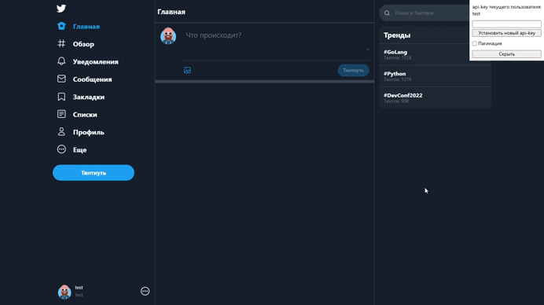

<h1 align="center">Twitter-clone</h1>
<h1 align="center"></h1>

## Содержание
- [Описание](#описание) 
- [Как использовать](#как-использовать)
- [Функциональность](#функциональность)
- [О проекте](#о-проекте)
- [Запуск тестов](#запуск-тестов)
- [Технологии](#технологии)
- [Запуск](#запуск)

## Описание
Сервис микроблогов, похожий на Twitter
Дает возможность твитнуть текст + прикрепить картинки, поставить лайк, подписаться на пользователя.
<h2 align="center"></h2>

## Как использовать
- В правом верхнем углу сменить пользователя. Нужно ввести ник, нажать на кнопку "Установить новый api-key"
- Набрать текст, нажать "твитнуть".
- Кликнуть на портрет автора понравившегося твита, нажать "читать".
- Для удаления твита, нажать на три точки, "удалить".

## Функциональность
1. Пользователь может добавить новый твит.
2. Пользователь может удалить свой твит.
3. Пользователь может зафоловить другого пользователя.
4. Пользователь может отписаться от другого пользователя.
5. Пользователь может отмечать твит как понравившийся.
6. Пользователь может убрать отметку «Нравится».
7. Пользователь может получить ленту из твитов отсортированных в
порядке убывания по популярности от пользователей, которых он
фоловит.
8. Твит может содержать картинку.
## О проекте.
### Три контейнера docker
- DB Postgresql
- backend python + Fastapi
- frontend + nginx

Запросы перенаправляются при помощи nginx на backend. Изображения сохраняются в директории db/images.<br/>
Для просмотра документации backend, на странице приложения добавьте /docs к url адресу.<br/> 
### Запуск тестов
Для запуска тестов необходимо установить зависимости <br/>
```pip install -r app\requirementx.txt```<br/>
```pip install -r tests\requirementx.txt```<br/>
Запустить базу данных Postgresql для этого введите следующую команду:<br/>
```docker run --name database -e POSTGRES_USER=admin -e POSTGRES_PASSWORD=admin -e POSTGRES_DB=twitter -v ./db:/var/lib/postgresql/data -d -p 5433:5432 postgres```<br/>
В терминале находясь в директории tests ввести в терминале ```pytest```
## Запуск
- необходимо установить docker
- Находясь в директории с проектом, введите в терминале ```docker compose up -d```
- Дождитесь завершения установок зависимостей
- Перейдите по адресу http://localhost/
## Технологии
- fastapi
- sqlalchemy
- nginx
- docker